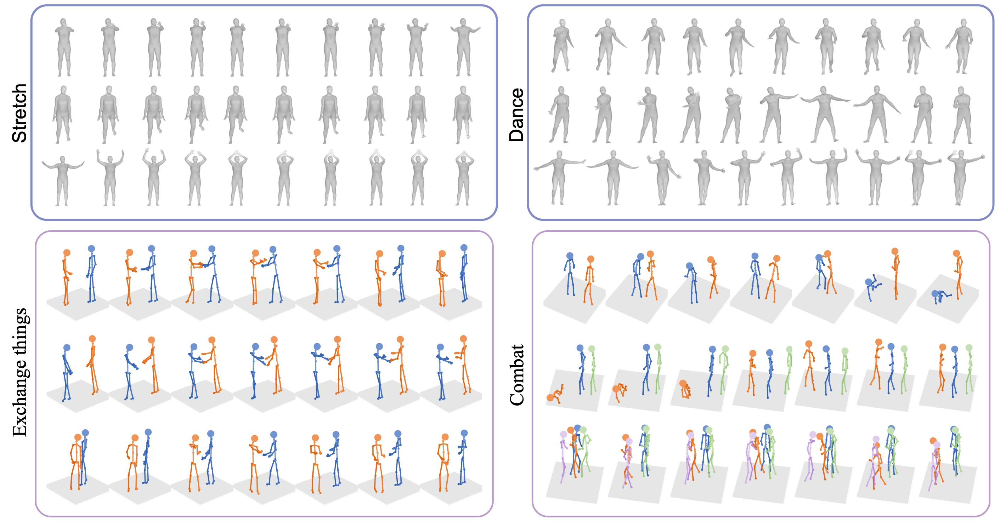

[](https://arxiv.org/abs/2203.07706)

## ActFormer: A GAN-based Transformer towards General Action-Conditioned 3D Human Motion Generation (ICCV 2023)

[**Project Page**](https://liangxuy.github.io/actformer/) | [**Paper**](https://arxiv.org/abs/2203.07706)

### Overview

We propose a GAN-based Transformer for general action-conditioned 3D human motion generation, including single-person actions and multi-person interactive actions. 



## Environment

It is highly encouraged to set up an independent environment with Conda.

```
conda create --name actformer python=3.8
conda activate actformer
```

This code implementation is based on PyTorch. We have tested with *pytorch 1.5.0*, while other close or newer versions should also work. 
Please first **install a PyTorch version which fits your compute platform**.

Then run the following command to install other dependencies.

```
pip install -r requirements.txt
```

## Data Preparation

### NTU RGB+D 120

* Download skeleton data of the [NTU RGB+D 120 dataset](https://rose1.ntu.edu.sg/dataset/actionRecognition/) and the [record about samples with missing skeletons](https://github.com/shahroudy/NTURGB-D/blob/master/Matlab/NTU_RGBD120_samples_with_missing_skeletons.txt).
* Put the downloaded data in a same path: <path_to_downloaded_data>.
* Run our preprocessing code.
```
1. python datasets/ntu120/prepare_ntu_data.py -s <path_to_downloaded_data>
2. python datasets/ntu120/split_train_test.py -d datasets/ntu120/data1p/ntu120.h5 -o datasets/ntu120/data1p
3. python datasets/ntu120/split_train_test.py -d datasets/ntu120/data2p/ntu120.h5 -o datasets/ntu120/data2p --two_person
```

### NTU RGB+D 120 SMPL

* Download the RGB videos of [NTU RGB+D 120 dataset](https://rose1.ntu.edu.sg/dataset/actionRecognition/) and put them in the following directory: <ntu_video_dir>.
```
<ntu_video_dir>
└───nturgb+d_rgb_s001
└───nturgb+d_rgb_s002
└───...
```
* Extract the SMPL parameters from videos using [aistplusplus_api](https://github.com/google/aistplusplus_api).
* Run our preprocessing code `datasets/ntu120_smpl/prepare_data.py`. Please modify the `SRC` to the folder of the extracted SMPL results.
```
1. python datasets/ntu120_smpl/prepare_data.py
2. python split_1p.py
```

### BABEL

* Download MoCap data from [AMASS](https://amass.is.tue.mpg.de/) and semantic labels from [BABEL](https://babel.is.tue.mpg.de/).
* Put the downloaded data in a same path.
* Run our preprocessing code.
```
python datasets/babel/prepare_data.py -s <path_to_downloaded_data>
```

### GTA Combat Dataset

<!-- For the GTA Combat Dataset, you could directly download the processed files [here](https://code.eias.ac.cn/xuliang/gta_combat_dataset). -->

For the GTA Combat Dataset, you can directly download the processed files from [Google Drive](https://drive.google.com/drive/folders/1bDIZJW4iNYl1Yoz2W5h6fHa93ytaWh7K?usp=drive_link) or [百度云下载链接](https://pan.baidu.com/s/1EgjFHiz7mZ4ZhGfxeScboA?pwd=e8xn).


### SMPL files

Download the SMPL neutral models from the [SMPL website](https://smpl.is.tue.mpg.de/) and move them to ``data/smpl``.

```
smpl/
|-- J_regressor_extra.npy
|-- SMPL_NEUTRAL.pkl
|-- kintree_table.pkl
`-- smplfaces.npy
```

## Train

* ActFormer
```
# NTU RGB+D 120 (1P)
python main.py generator -c config/generator/ntu120_1p/actformer.yaml

# BABEL
python main.py generator -c config/generator/babel/actformer.yaml

# NTU RGB+D 120 (2P)
python main.py generator -c config/generator/ntu120_2p/actformer.yaml

# GTA Combat (2P)
python main.py generator -c config/generator/gta/actformer_2p.yaml  # Similar for 3P / 4P/ 5P
```


## Generate with trained model

```
# NTU RGB+D 120 (1P)
python main.py generator -c config/generator/ntu120_1p/actformer.yaml --phase gen --model_weights <path_to_trained_model (.pt file)> --work_dir work_dir/generate/ntu120_1p

# BABEL
python main.py generator -c config/generator/babel/actformer.yaml --phase gen --model_weights <path_to_trained_model (.pt file)> --work_dir work_dir/generate/babel

# NTU RGB+D 120 (2P)
python main.py generator -c config/generator/ntu120_2p/actformer.yaml --phase gen --model_weights <path_to_trained_model (.pt file)> --work_dir work_dir/generate/ntu120_2p
```

## Visualization

Code for visualizing real/synthetic skeleton data is provided.
* Visualize data from NTU RGB+D 120:
```
python visualize/visualize_skt.py \
    --src_path datasets/ntu120/data2p/xsub.train.h5 \
    --adj_file datasets/ntu120/ntu_adjacency.h5 \
    --save_path real_data_vis/ntu120_2p \
    --save_video 
```
* Visualize data from BABEL
(Please first download the **SMPL model** (SMPL_NEUTRAL is prefered) from [SMPL](smpl.is.tue.mpg.de) and put it in `datasets/babel/`):
```
python visualize/visualize_skt_smpl.py \
    --src_path datasets/babel/train120.h5 \
    --adj_file datasets/babel/smpl_adjacency.h5 \
    --save_path real_data_vis/babel \
    --save_video 
```

* Visualize data from GTA Combat Dataset:
```
python visualize/visualize_skt_gta.py \
    --src_path  datasets/gta/gta_combat_2p.h5 \
    --adj_file datasets/gta/gta_adjacency.h5 \
    --save_path real_data_vis/gta_2p \
    --save_video 
```


## Evaluation

* Train the ST-GCN action recognition model for quantitative evaluation.
```
# NTU RGB+D 120 (1P)
python main.py recognition -c config/recognition/ntu120_1p.yaml

# BABEL
python main.py recognition_resample -c config/recognition/babel.yaml

# NTU RGB+D 120 (2P)
python main.py recognition -c config/recognition/ntu120_2p.yaml
```

* Evaluate using the trained ST-GCN action recognition model
```
# NTU RGB+D 120 (1P)
python main.py evaluator -c config/eval_motion/ntu120_1p.yaml --acc --fid

# BABEL
python main.py evaluator -c config/eval_motion/babel.yaml --acc --fid

# NTU RGB+D 120 (2P)
python main.py evaluator -c config/eval_motion/ntu120_2p.yaml --acc --fid
python main.py evaluator -c config/eval_motion_multip/ntu120_2p.yaml --fid --aggregate    # Aggregate FID
```


## TODO

- [x] Release the code, including the training/evaluating scripts.
- [x] Release the GTA Combat dataset and the visualization script.
- [ ] Release the evaluation script for GTA Combat dataset.
- [ ] Release the trained models.


## Citation
If you find our work useful in your research, please consider citing:
    
    @article{xu2023actformer,
      title={ActFormer: A GAN-based Transformer towards General Action-Conditioned 3D Human Motion Generation},
      author={Xu, Liang and Song, Ziyang and Wang, Dongliang and Su, Jing and Fang, Zhicheng and Ding, Chenjing and Gan, Weihao and Yan, Yichao and Jin, Xin and Yang, Xiaokang and others},
      journal={{ICCV}},
      year={2023}
    }